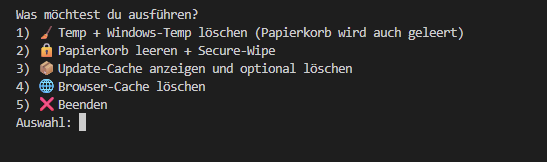

# pyDatenträgerbereinigen (Python)

# pyDatentraegerbereinigen


Ein schneller, sicherer und kompakter System-Cleaner für Windows, geschrieben in Python.  
Das gesamte Tool befindet sich in **einer einzigen Datei**: `temporaereDaten.py`.

Es bietet ein übersichtliches Menü mit mehreren Funktionen wie Temp-Cleaning, Update-Cache-Analyse,
Browser-Cache-Löschung und optionalem Secure-Wipe.  
Alle Funktionen arbeiten lokal, ohne Internet, ohne externe Pakete.

---

## 🚀 Features

- 🧹 **Temp + Windows-Temp Cleaner**
- 🗑️ **Papierkorb leeren**
- 🔒 **Secure-Wipe (optional)**
- 📦 **Update-Cache Analyse + optionales Löschen**
- 🌐 **Browser-Cache Analyse + Löschen**
- 📊 **Statistik-Ausgabe**
- 🔁 **Endlosschleife mit Exit-Option**
- 🛡️ **Keine externen Pakete notwendig**

---

## 📸 Menü-Screenshot




## 📦 Installation

### 1️⃣ Repository klonen

```bash
git clone https://github.com/mobyNet/pyDatenträgerbereinigen.git
cd pyDatenträgerbereinigen
